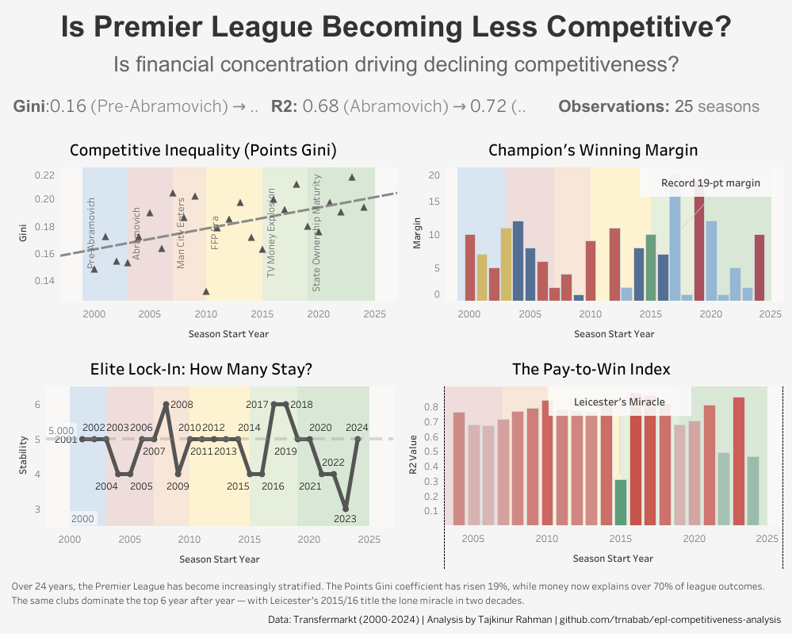

# EPL Competitiveness Analysis

Analyzing whether financial inequality is driving competitive decline in the Premier League (2000-2024) using Databricks, PySpark, Delta Lake, Plotly, and Tableau.

## Research Question
**"Is the Premier League becoming less competitive, and is financial inequality driving this change?"**

## 🔗 Live Dashboards
### The Decline
[](https://public.tableau.com/views/TheDeclineepl-competitiveness-analysis/Dashboard1?:language=en-US&publish=yes&:sid=&:redirect=auth&:display_count=n&:origin=viz_share_link)

### The Money Trail
[](https://public.tableau.com/views/TheMoneyTrailepl-competitiveness-analysis/Dashboard1?:language=en-US&publish=yes&:sid=&:redirect=auth&:display_count=n&:origin=viz_share_link)
```


## Tech Stack
- **Platform**: Databricks (Spark 4.0.0)
- **Languages**: Python, PySpark, SQL
- **Storage**: Delta Lake
- **Visualization**: Plotly, Tableau
- **Data Source**: Transfermarkt (web scraping with BeautifulSoup)

## Project Structure
| Notebook | Purpose |
|----------|---------|
| `01_data_ingestion` | Scrape squad values, transfer spending, and league tables from Transfermarkt (2000-2024) |
| `02_data_processing` | Standardize club names across 46 clubs, join into unified dataset |
| `03_metric_calculations` | Calculate Gini coefficients, HHI, correlations, regressions, era comparisons |
| `04_dashboard_the_decline` | Plotly visualizations showing competitive decline |
| `05_dashboard_the_money_trail` | Plotly visualizations revealing the financial causes |

## Dashboards

### Dashboard 1: The Decline
**Story:** The Premier League is becoming less competitive — and we can prove it.

| Chart | Insight |
|-------|---------|
| Points Gini | Rising from 0.15 → 0.22 (league becoming more unequal) |
| Champion's Margin | Man City's 2018 record 19-point margin |
| Top 6 Stability | Same clubs dominate year after year |
| Pay-to-Win Index (R²) | Money explains 67-89% of results; Leicester 2015 the lone miracle |

### Dashboard 2: The Money Trail
**Story:** Financial inequality is driving the decline — but not in the way you'd expect.

| Chart | Insight |
|-------|---------|
| Financial Gini | Declining (0.36 → 0.27) — money is spreading out |
| Market Value Std Dev | Exploding (€86m → €324m) — absolute gap quadrupled |
| The Paradox | Financial Gini ↓ while Points Gini ↑ — opposite trends |
| Value vs Position | Money buys position — clear negative correlation |
| Correlation Over Time | Consistently strong (-0.7 to -0.9) — no escape |

## Key Findings

### The Paradox
Financial concentration is **decreasing** (more clubs have money) but competitive inequality is **increasing**. Why?

**The Threshold Effect:** The baseline cost of competing has risen so dramatically that even though money is "spreading out," most clubs still can't cross the spending threshold required to compete. The absolute gap matters more than relative distribution.

### By the Numbers
- **Points Gini:** 0.15 → 0.22 (↑47%)
- **Financial Gini:** 0.36 → 0.27 (↓25%)
- **Market Value Std Dev:** €86m → €324m (↑277%)
- **Money-Position Correlation:** Consistently -0.7 to -0.9
- **R² (Money explains results):** 67-89% in most seasons

## Data Coverage
- 25 seasons (2000/01 - 2024/25)
- 500 club-season records
- Squad market values available from 2004/05
- Transfer spending available for all seasons

## Delta Lake Tables
| Table | Records | Description |
|-------|---------|-------------|
| `squad_market_values` | 500 | Squad valuations per club per season |
| `transfer_spending` | 500 | Transfer income/expenditure per club per season |
| `league_tables` | 500 | Final standings, points, wins, goals |
| `unified_season_data` | 500 | Joined dataset with era labels |
| `competitiveness_metrics` | 25 | All metrics per season |
| `era_comparison` | 6 | Average metrics by financial era |

## Repository Structure
```
epl-competitiveness-analysis/
├── README.md
├── notebooks/
│   ├── 01_data_ingestion.ipynb
│   ├── 02_data_processing.ipynb
│   ├── 03_metric_calculations.ipynb
│   ├── 04_dashboard_the_decline.ipynb
│   └── 05_dashboard_the_money_trail.ipynb
├── images/
│   ├── the_decline.png
│   ├── the_money_trail.png
├── data/
│   ├── competitiveness_metrics.csv
│   ├── era_comparison.csv
│   └── unified_season_data.csv
└── dashboards/
    └── the_decline.twbx
    └── the_money_trail.twbx

```

## Author
**Tajkinur Rahman**  
[GitHub](https://github.com/trnabab) | [Tableau Public](https://public.tableau.com/app/profile/tajkinur.rahman)